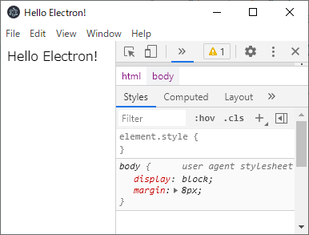

Electronをサクっと試す。

作成したい構成
```directory
project
├ nodemodules/
├ index.html
├ main.js
├ package-lock.json
└ package.json
```

```npm
npm init -y
npm install electron
```


#### **`index.html`**
```html
<!DOCTYPE html>
<html>
  <head>
    <meta charset="UTF-8">
    <title>Hello Electron!</title>
  </head>
  <body>
    Hello Electron!
  </body>
</html>
```


#### **`main.js`**
```javascript
const electron = require('electron');
const app = electron.app;
const BrowserWindow = electron.BrowserWindow;

let mainWindow = null;
app.on('ready', () => {
  // mainWindowを作成
  mainWindow = new BrowserWindow({ width: 400, height: 300 });

  // Electronに表示するhtmlを指定
  mainWindow.loadURL(__dirname + '/index.html');

  // ChromiumのDevツールを開く
  mainWindow.webContents.openDevTools();

  // クローズ処理
  mainWindow.on('closed', function () {
    mainWindow = null;
  });
});
```


```npm
npx electron main
```




# ファイルを読み込む

