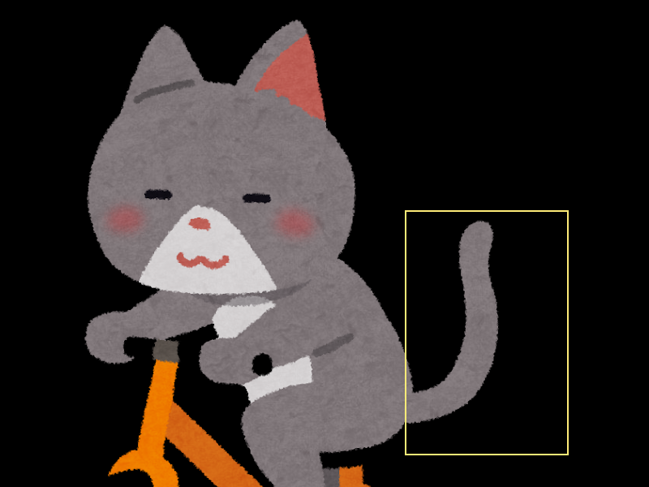
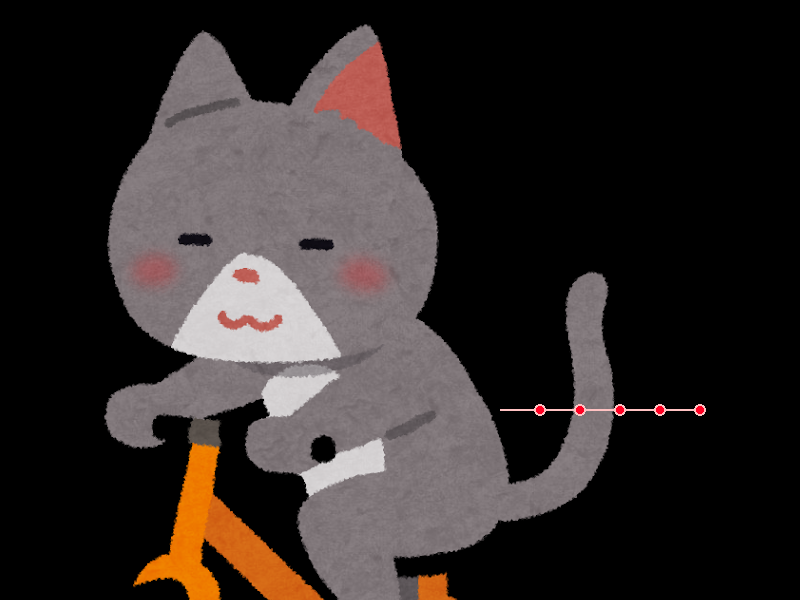

```javascript
// https://www.irasutoya.com/2014/06/blog-post_2764.html

const app = new PIXI.Application();
document.body.appendChild(app.view);

const cat = PIXI.Sprite.from('img/jitensya_neko.png');
app.stage.addChild(cat);

// 猫のしっぽの範囲を確認
// const graphics = new PIXI.Graphics();
// graphics.lineStyle(2, 0xFEEB77, 1);
// graphics.drawRect(500, 260, 200, 300);
// graphics.endFill();
// app.stage.addChild(graphics);

// 元の画像を黒で消す
const graphics = new PIXI.Graphics();
graphics.beginFill(0x000000);
graphics.drawRect(500, 260, 200, 300);
graphics.endFill();
app.stage.addChild(graphics);

const tailContainer = new PIXI.Container();
app.stage.addChild(tailContainer);

const pointCount = 6;
const ropeLength = 200 / (pointCount - 1)
const points = [];
for (let i = 0; i < pointCount; i++) {
    // ポイントを設定。横幅は均等に、そして高さは真ん中に配置
    points.push(new PIXI.Point(i * ropeLength, 150));
}
const texture = new PIXI.Texture(PIXI.BaseTexture.from('img/jitensya_neko.png'), new PIXI.Rectangle(500, 260, 200, 300));
const tail = new PIXI.SimpleRope(texture, points);
tail.position.set(500, 260);

tailContainer.addChild(tail);

const g = new PIXI.Graphics();
g.x = tail.x;
g.y = tail.y;
app.stage.addChild(g);
//renderPoints(g);

let count = 0;
app.ticker.add(() => {
    count += 0.1;

    for (let i = 0; i < points.length; i++) {
        if (i > 1) {
            points[i].y = 150 + Math.cos(count) * i * i;
        }
    }
    //renderPoints(g);
});

//Pointの位置を確認する。
function renderPoints(g) {
    g.clear();

    g.lineStyle(2, 0xffc2c2);
    g.moveTo(points[0].x, points[0].y);

    for (let i = 1; i < points.length; i++) {
        g.lineTo(points[i].x, points[i].y);
    }

    for (let i = 1; i < points.length; i++) {
        g.beginFill(0xff0022);
        g.drawCircle(points[i].x, points[i].y, 5);
        g.endFill();
    }
}
```


# 解説

## 猫のしっぽの位置をGraphicsで囲って確認
```javascript
const app = new PIXI.Application();
document.body.appendChild(app.view);

const cat = PIXI.Sprite.from('img/jitensya_neko.png');

app.stage.addChild(cat);

const graphics = new PIXI.Graphics();
graphics.lineStyle(2, 0xFEEB77, 1);
graphics.drawRect(500, 260, 200, 300);
graphics.endFill();
app.stage.addChild(graphics);
```



## 猫のしっぽの範囲をSimpleRopeさせる。
元の画像は黒く塗って、上からSiｍpleRopeで重ねる。
SimpleRopeのポイントの初期値は、
横幅： 0から均等に配置
高さ： 高さ/2
で配置すると元の画像とほぼ同じ位置にレンダリングできる。
```javascript
// 元の画像を黒で消す
const graphics = new PIXI.Graphics();
graphics.beginFill(0x000000);
graphics.drawRect(500, 260, 200, 300);
graphics.endFill();
app.stage.addChild(graphics);

// コンテナ作成
const tailContainer = new PIXI.Container();
app.stage.addChild(tailContainer);

// Ropeで表示
const pointCount = 6;
const ropeLength = 200 / (pointCount - 1)
const points = [];
for (let i = 0; i < pointCount; i++) {
    // ポイントを設定。横幅は均等に、そして高さは真ん中に配置
    points.push(new PIXI.Point(i * ropeLength, 150));
}
const texture = new PIXI.Texture(PIXI.BaseTexture.from('img/jitensya_neko.png'), new PIXI.Rectangle(500, 260, 200, 300));
const tail = new PIXI.SimpleRope(texture, points);
tail.position.set(500, 260);
tailContainer.addChild(tail);
```

# Pointを可視化させる。
Pointが見えないので、どのように動いてるか、わかりにくいので、functionを作る。
```javascript
function renderPoints(g) {
    g.clear();

    g.lineStyle(2, 0xffc2c2);
    g.moveTo(points[0].x, points[0].y);

    for (let i = 1; i < points.length; i++) {
        g.lineTo(points[i].x, points[i].y);
    }

    for (let i = 1; i < points.length; i++) {
        g.beginFill(0xff0022);
        g.drawCircle(points[i].x, points[i].y, 5);
        g.endFill();
    }
}
```

呼び出してあげる。
```javascript
const g = new PIXI.Graphics();
g.x = tail.x;
g.y = tail.y;
app.stage.addChild(g);
renderPoints(g);
```



# しっぽを動かしてみよう
Pointの位置をずらすだけで画像を動かすことができます。
```javascript
let count = 0;
app.ticker.add(() => {
    count += 0.1;

    for (let i = 0; i < points.length; i++) {
        if (i > 1) {
            points[i].y = 150 + Math.cos(count) * i * i;
        }
    }
    renderPoints(g);
});
```

